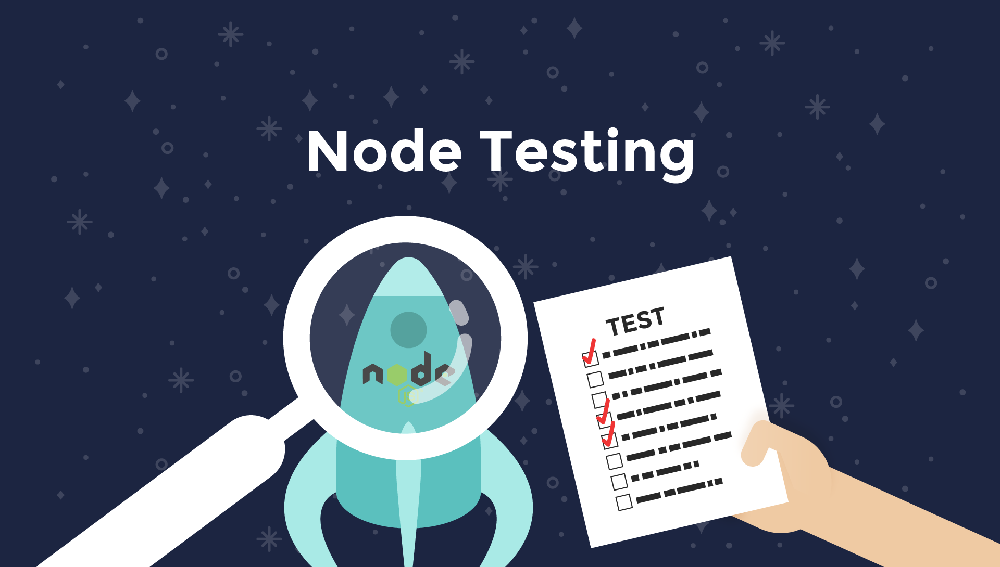

footer: © NodeProgram.com, Node.University and Azat Mardan 2017
slidenumbers: true
theme: Simple, 1
build-lists: true

[.slidenumbers: false] 
[.hide-footer]



---

# Node Testing
## How to Test Modules, APIs and UIs the Node Way


Azat Mardan @azat_co


---

# Table of Contents

---

## Module 1: Course Overview

* What to expect
* Why testing is important
* What you need

---

## Module 2: Unit testing

* Setting up testing framework: Mocha, Expect, Axios
* Describe, `it`
* TDD assertion
* BDD style: Chai expect

---

## Module 2: Unit testing (cont)

* after and before
* each and afterEach, beforeEach
* Writing unit tests
* (TDD+ BDD): Mocha, Expect, Jest, Superagent, Unit and Functional/Integration Testing

Create Node Testing with Mocha for unit testing, then for REST API and for UI testing (e2e)

---

## Module 3: Functional/integration testing

* Testing CRUD REST API server (Mocking)
* Testing CRUD REST API server (real)
* Testing GraphQL server

---

## Module 4: UI and E2E Testing

* Testing UI with Selenium WebDriver

---

## CI/CD

* Using CircleCI: creating yml config
* Using AWS and Jenkins

## Outro

* Summary

---

# Node Testing
## Overview


Azat Mardan @azat_co


---


## Module 1: Course Overview

* What to expect
* Why testing is important
* What you need

---

## What to expect

* Unit testing
* API testing
* UI testing
* CI/CD
* Best tech stack
* No B.S. - Only necessary stuff

---

## Why testing is important

* Save time in the long-term
* Catch bugs -> better quality of software
* Automate deployment -> faster iteration -> better product
* Get confidence during refactor
* Document interface

---

## Testing Pyramid


---

## What you need

* Node v8+
* npm v5+
* Terminal
* Code editor
* [Selenium WebDriver server and Node client](http://www.seleniumhq.org/download/)

---

# Node Testing
## Module 2: Unit Testing


Azat Mardan @azat_co


---

## Testing Framework

* Mocha
* Chai Expect

---

## Setting up Testing Framework

1. Create a new folder
2. Create package.json
3. Install dependencies
4. Write sample tests
5. Write sample code

---

## Escape Module

Converts special characters to HTML code

* `&` into `&amp;`
* `"` into `&quot;`
* `'` into `&#39;`
* `<` into `&lt;`
* `>` into `&gt;`

---

```
mkdir escape
cd escape
npm init -y
npm i mocha@3.5.0 chai@4.1.2 -E
mkdir tests
```

---

## Describe and it


---

* TDD assertion
* BDD style: Chai expect

---

## Module 2: Unit testing (cont)

* after and before
* each and afterEach, beforeEach
* Writing unit tests
* (TDD+ BDD): Mocha, Expect, Jest, Superagent, Unit and Functional/Integration Testing

Create Node Testing with Mocha for unit testing, then for REST API and for UI testing (e2e)

---

# Node Testing
## Module 3: Functional/integration testing


Azat Mardan @azat_co


---

## Module 3: Functional/integration testing

* Testing CRUD REST API server (Mocking)
* Testing CRUD REST API server (real)
* Testing GraphQL server

---

# Node Testing
## Module 4: UI and E2E Testing


Azat Mardan @azat_co


---

* Testing UI with Selenium WebDriver

---

# Node Testing
## CI/CD


Azat Mardan @azat_co


---

* Using CircleCI: creating yml config
* Using AWS and Jenkins

---

# Node Testing
## Outro


Azat Mardan @azat_co


---

## Summary